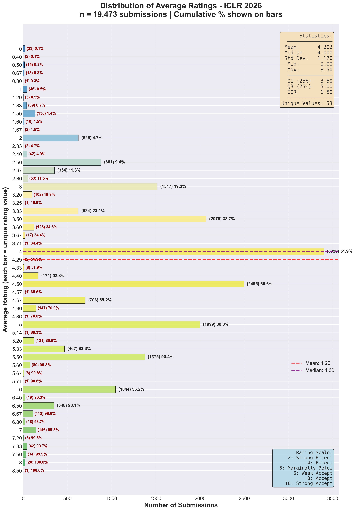
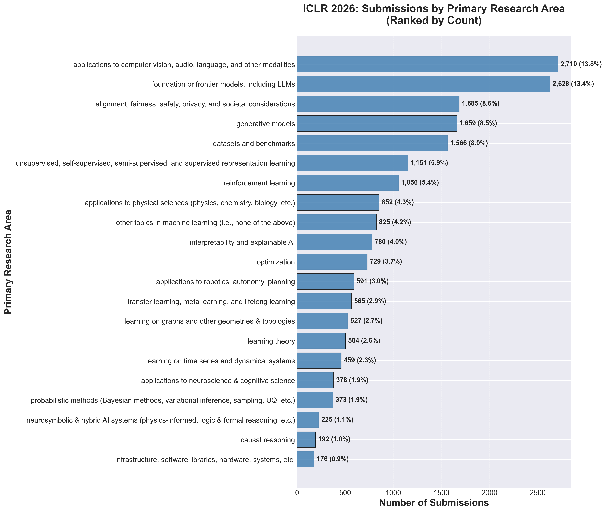
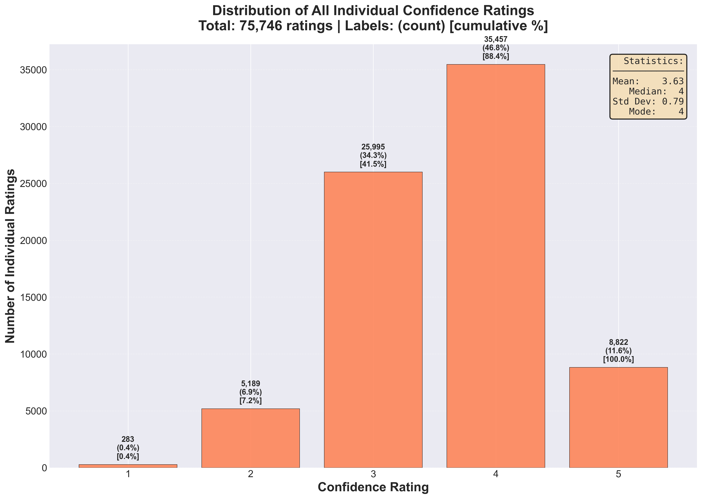

# Smart AI Conference

[](https://www.python.org/downloads/)
[](https://opensource.org/licenses/MIT)

A comprehensive toolkit for analyzing AI/ML conference submissions using OpenReview data. Extract, analyze, and visualize submission ratings, reviewer confidence, and research area distributions for any OpenReview-hosted conference.

## 🎯 Features

- **Automated data collection** from OpenReview API with intelligent rate limiting
- **Fast extraction** of ratings and metadata (~55,000 submissions/second)
- **Visualizations** with customizable color schemes
- **Comprehensive analysis** across multiple research areas
- **Incremental saves** with checkpoint support for robustness
- **Flexible and reusable** for any OpenReview conference (ICLR, NeurIPS, ICML, etc.)

## 📊 Completed Analysis: ICLR 2026

Successfully analyzed **19,631 submissions** with **74,432 reviews** from ICLR 2026.

### 🎨 View Visualizations

**📁 All ICLR 2026 plots**: [`outputs/iclr_2026/`](./outputs/iclr_2026/)

This folder contains **26 publication-quality visualizations**:
- Overall rating distribution with cumulative percentages
- 21 area-specific rating distributions
- Confidence level distributions
- Research area submission counts
- Multi-dimensional analyses

### Key Statistics
- **Average rating**: 4.26 / 10 (median: 4.0)
- **Review coverage**: 99.1% of submissions (19,450 papers)
- **Average reviews per paper**: 3.79
- **Reviewer confidence**: 3.62 / 5 (moderate-high)
- **Top research areas**: 
  - CV/Audio/Language Applications (13.8%)
  - Foundation/Frontier Models & LLMs (13.4%)
  - Alignment/Fairness/Safety (8.6%)

### Featured Plots

Browse [`outputs/iclr_2026/`](./outputs/iclr_2026/) or preview key visualizations:

| Plot | Description |
|------|-------------|
|  | **Average Rating Distribution**<br>Shows distribution of 19,450 submissions with cumulative % |
|  | **Submissions by Research Area**<br>Ranked by submission count across 21 areas |
|  | **Reviewer Confidence Distribution**<br>74,432 individual confidence ratings |

**💡 Note**: Raw data files (26GB) are not included in this repository due to size. The analysis code can regenerate them from OpenReview.

## 🚀 Quick Start

### Explore ICLR 2026 Visualizations (No Setup Required)

Browse the completed analysis visualizations:

```bash
# View the plots
cd outputs/iclr_2026/

# Main visualizations
open average_rating_distribution.png  # Overall distribution
open area_distribution.png           # Submissions by area
open all_confidence_distribution.png  # Reviewer confidence

# Area-specific distributions
ls rating_dist_*.png                 # 21 research area plots
open rating_dist_foundation_or_frontier_models,_including_LLMs.png
```

Or simply browse the [`outputs/iclr_2026/`](./outputs/iclr_2026/) folder on GitHub.

### Run Your Own Analysis

### Prerequisites

```bash
# Python 3.8 or higher
python --version

# Conda (recommended) or pip
conda --version
```

### Installation

```bash
# Clone the repository
git clone <your-repo-url>
cd Data_AI

# Automated setup (creates environment and installs dependencies)
./setup.sh

# Or manual setup
conda create -n iclr_analysis python=3.9
conda activate iclr_analysis
pip install -r requirements.txt
```

### Basic Usage

```bash
# Activate environment
conda activate iclr_analysis

# 1. Scrape submissions from OpenReview (~30-60 minutes for large conferences)
python src/scrape_iclr_submissions.py

# 2. Extract ratings from metadata (<1 second)
python src/extract_ratings_fast.py

# 3. Generate visualizations
python src/plot_rating_distribution.py    # Main distribution
python src/plot_rating_by_area.py         # Per-area distributions
python src/analyze_distributions.py       # Additional analyses
```

### One-Command Pipeline

```bash
# Run complete analysis pipeline
./run_all.sh
```

## 📁 Project Structure

```
.
├── README.md                         # This file
├── LICENSE                           # MIT License
├── requirements.txt                  # Python dependencies
├── .gitignore                       # Git exclusions
├── setup.sh                         # Environment setup script
├── run_all.sh                       # Complete pipeline script
│
├── src/                             # Source code
│   ├── scrape_iclr_submissions.py   # Data collection from OpenReview
│   ├── extract_ratings_fast.py      # Parse & structure ratings data
│   ├── plot_rating_distribution.py  # Main distribution visualization
│   ├── plot_rating_by_area.py       # Area-specific plots
│   └── analyze_distributions.py     # Additional distribution analyses
│
├── outputs/                         # 🎨 Example visualizations (on GitHub)
│   └── iclr_2026/                  # ICLR 2026 analysis results (26 plots)
│       ├── average_rating_distribution.png
│       ├── area_distribution.png
│       ├── all_confidence_distribution.png
│       ├── all_overall_ratings_distribution.png
│       ├── avg_confidence_distribution.png
│       └── rating_dist_[area].png  # 21 per-area distributions
│
├── data/                            # 📊 Data directory (generated, gitignored)
│   ├── submissions_metadata.json    # Raw scraped data (generated when you run)
│   └── ratings_data.csv            # Processed ratings (generated when you run)
│
└── docs/                           # 📚 Additional documentation
```

**💡 Note**: 
- `outputs/iclr_2026/` contains completed ICLR 2026 visualizations
- Raw data files (26GB) are gitignored - run the scripts to generate them
- New analyses will save data to `data/` and plots to `outputs/`

## 🔧 Configuration

### For Different Conferences

To analyze a different conference, modify the `venue_id` in `src/scrape_iclr_submissions.py`:

```python
# Examples:
venue_id = "ICLR.cc/2026/Conference"       # ICLR 2026
venue_id = "NeurIPS.cc/2024/Conference"    # NeurIPS 2024
venue_id = "ICML.cc/2024/Conference"       # ICML 2024
```

### Customization Options

**Color schemes**: Edit `colors_list` in visualization scripts  
**Rate limiting**: Adjust `time.sleep()` values in scraper  
**Minimum submissions**: Change `min_submissions` parameter in area analysis  
**Plot dimensions**: Modify `figsize` in plotting functions

## 📈 Data Fields

### Extracted Information

Each submission includes:
- **Metadata**: Title, abstract, keywords, primary area, submission date
- **Ratings**: Overall (1-10), soundness, presentation, contribution
- **Confidence**: Reviewer confidence levels (1-5)
- **Review text**: Summary, strengths, weaknesses, questions
- **Statistics**: Mean, median, variance, cumulative distributions

### Output Data Structure

**ratings_data.csv** contains:
- `submission_number`: Paper ID
- `primary_area`: Research area classification
- `num_reviews`: Number of reviews received
- `ratings`: List of overall ratings
- `confidences`: List of reviewer confidence scores
- `soundness`, `presentation`, `contribution`: Dimension-specific ratings
- `avg_rating`, `min_rating`, `max_rating`: Computed statistics
- `avg_confidence`: Average reviewer confidence

## 🎨 Visualization Features

All plots include:
- ✨ **Color gradient**: Blue (low) → Yellow (mid) → Green (high)
- 📊 **Detailed labels**: Count, percentage, and cumulative percentage
- 📈 **Statistics boxes**: Mean, median, std dev, quartiles
- 📍 **Reference lines**: Mean and median markers
- 🎯 **Professional styling**: Publication-ready at 300 DPI

### Generated Plots

1. **Average Rating Distribution** - Overall rating distribution with cumulative %
2. **Area-Specific Distributions** - Separate plots for each research area
3. **Confidence Analysis** - Reviewer confidence patterns
4. **Area Submission Counts** - Submissions by research area (ranked)
5. **All Individual Ratings** - Distribution of all individual review ratings

## 🔬 Use Cases

### Research Applications

- **Conference organizers**: Understand submission patterns and reviewer behavior
- **Researchers**: Analyze acceptance thresholds and competitiveness by area
- **Meta-research**: Study peer review processes and rating distributions
- **Trend analysis**: Identify emerging research areas and topics

### Example Analyses

```python
import pandas as pd

# Load processed data
df = pd.read_csv('data/ratings_data.csv')

# High-rated papers
high_rated = df[df['avg_rating'] >= 7.0]
print(f"Papers with rating ≥ 7: {len(high_rated)} ({len(high_rated)/len(df)*100:.1f}%)")

# Most competitive areas
area_stats = df.groupby('primary_area')['avg_rating'].agg(['mean', 'count', 'std'])
most_competitive = area_stats.sort_values('mean')
print("Most competitive areas (lowest avg ratings):")
print(most_competitive.head())

# Reviewer confidence vs rating correlation
import numpy as np
correlation = np.corrcoef(df['avg_rating'].dropna(), df['avg_confidence'].dropna())[0,1]
print(f"Confidence-Rating correlation: {correlation:.3f}")
```

## ⚙️ Advanced Usage

### Batch Processing Multiple Conferences

```bash
# Modify venue_id for each conference, then run:
for venue in "ICLR.cc/2026" "NeurIPS.cc/2024" "ICML.cc/2024"; do
  # Update venue_id in script
  python src/scrape_iclr_submissions.py
  python src/extract_ratings_fast.py
  python src/plot_rating_distribution.py
done
```

### Custom Filtering

```python
# Filter papers by area and rating
df = pd.read_csv('data/ratings_data.csv')

llm_papers = df[df['primary_area'].str.contains('LLM|foundation', case=False)]
high_variance = df[df['num_reviews'] >= 3]
high_variance['rating_std'] = high_variance['ratings'].apply(lambda x: np.std(eval(x)))
controversial = high_variance.nlargest(10, 'rating_std')
```

## 🤝 Contributing

Contributions are welcome! Areas for improvement:
- Support for additional conference platforms
- More analysis types (keyword analysis, temporal trends)
- Interactive visualizations
- Automated report generation

Please submit Pull Requests or open Issues for discussion.

## 📝 License

This project is licensed under the MIT License - see the LICENSE file for details.

## 🙏 Acknowledgments

- **OpenReview** for providing API and data access
- **ICLR, NeurIPS, ICML** and other conferences for open peer review
- The ML research community for open science practices

## 📧 Contact & Support

For questions, suggestions, or bug reports, please open an issue on GitHub.

## 🔗 Related Resources

- [OpenReview API Documentation](https://docs.openreview.net/)
- [ICLR Conference](https://iclr.cc/)
- [NeurIPS Conference](https://neurips.cc/)
- [ICML Conference](https://icml.cc/)

## 📊 Project Status

**Current Version**: Completed ICLR 2026 analysis  
**Next Steps**: Extend to other conferences (NeurIPS, ICML, CVPR)  
**Status**: Production-ready, actively maintained

---

### Citation

If you use this tool in your research, please cite:

```bibtex
@software{ai_conference_analyst,
  title={AI Conference Statistics Analyst},
  author={Your Name},
  year={2024},
  url={https://github.com/yourusername/Data_AI}
}
```

---

**Last Updated**: November 2024  
**Data Source**: OpenReview API  
**Example Dataset**: ICLR 2026 (19,631 submissions, 74,432 reviews)
